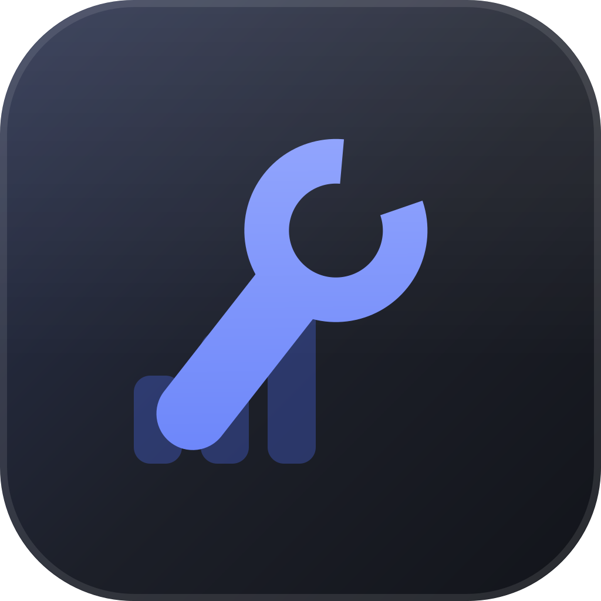

<div align="center">



# Natapadu

**Navigasi Master Data dan Alat Terpadu**

Aplikasi desktop untuk mengolah master data berukuran besar dari Excel — ratusan ribu hingga jutaan baris — dengan template dinamis, filter analitik, dan SQLite lokal. Berjalan sepenuhnya offline.

[](https://github.com/aribrilliantsyah/natapadu/actions/workflows/build.yml)
[](LICENSE)
[](https://go.dev)
[](https://svelte.dev)

</div>

---

## Kenapa Natapadu

Mengolah file Excel berisi ratusan ribu baris di aplikasi spreadsheet biasa berakhir dengan hal yang sama: lambat, boros memori, dan rawan rusak. Natapadu memindahkan data itu ke SQLite lokal, lalu semua pencarian, filter, dan sortir dijalankan sebagai query — bukan di memori browser atau spreadsheet.

Tidak ada server, tidak ada koneksi internet, tidak perlu Microsoft Excel terpasang. Satu berkas database, satu binary.

## Fitur

**Workspace** — Satu workspace menampung satu jenis master data (misalnya "Data Peserta"). Strukturnya dibuat sekali di awal, lalu bisa dibuka dan diisi ulang kapan saja. Setiap workspace punya tabel SQLite fisik tersendiri beserta indeks, bukan skema generik, sehingga performanya tetap terjaga di jutaan baris.

**Template dinamis** — Pemetaan kolom Excel, tipe data (`STRING`, `INTEGER`, `DECIMAL`, `CURRENCY`, `PERCENTAGE`, `DATE`, `DATETIME`, `BOOLEAN`), transformasi otomatis (`TRIM`, `UPPERCASE`, `NUMERIC_ONLY`, `CURRENCY_CLEAN`, …), dan aturan validasi — semuanya konfigurasi, tanpa mengubah kode. Struktur kolom bisa dideteksi otomatis dari berkas Excel contoh.

**Import streaming** — Baris dibaca lewat iterator sehingga berkas besar tidak pernah dimuat utuh ke memori, lalu ditulis per batch dalam satu transaksi. Progres tampil real-time. Baris yang gagal validasi dicatat lengkap beserta alasannya, bukan dibuang diam-diam.

**Pengisian manual** — Tambah dan ubah baris satu per satu lewat formulir yang mengikuti tipe kolom. Divalidasi dengan aturan yang sama persis dengan jalur import.

**Filter analitik** — Selain operator umum (`equals`, `contains`, `between`, `is_empty`, …):

| Kebutuhan | Cara |
|---|---|
| Cari data ganda | `nilainya ganda`, bisa dengan kunci gabungan beberapa kolom |
| Ambil baris unik saja | `nilainya unik` |
| Cocokkan banyak nilai | `salah satu dari` / `bukan salah satu dari` |
| Telusuri per kelompok | Panel **Nilai Unik** — pilih kolom, lalu maju satu per satu antar nilainya |
| Gabung kondisi | Sakelar **AND / OR** |

**Export** — XLSX, CSV (UTF-8 dengan BOM), atau OpenDocument `.ods`. Cakupannya bisa seluruh data, hasil filter yang sedang aktif, atau baris yang dicentang. Kolom yang ikut diekspor bisa dipilih.

**Template pengisian** — Unduh berkas Excel kosong yang header dan posisi kolomnya persis seperti yang dibaca importer, lengkap dengan sheet petunjuk berisi tipe data dan aturan validasi tiap kolom. Berkas yang diisi dijamin bisa di-import kembali.

**Dashboard** — Tingkat keberhasilan import, tren 14 hari, baris per workspace, dan sebaran aktivitas sistem.

**Lainnya** — Login lokal (bcrypt), audit log setiap operasi penting, backup database, serta mode gelap dan terang.

## Unduh

Ambil versi terbaru dari halaman [Releases](../../releases):

| Platform | Berkas |
|---|---|
| Linux x86_64 | `Natapadu-x86_64.AppImage` |
| Windows x64 | `Natapadu-windows-amd64.exe` |

Untuk AppImage, beri izin eksekusi lebih dulu:

```bash
chmod +x Natapadu-x86_64.AppImage
./Natapadu-x86_64.AppImage
```

> Build macOS belum disediakan.

**Login awal:** `admin` / `admin123` — segera ganti lewat **Pengaturan → Akun**.

## Menjalankan dari Sumber

**Prasyarat:** Go 1.25+, Node.js 22+, dan [Wails CLI](https://wails.io).

```bash
go install github.com/wailsapp/wails/v2/cmd/wails@latest
```

Di Linux, pasang juga pustaka sistemnya:

```bash
sudo apt-get install -y build-essential pkg-config libgtk-3-dev libwebkit2gtk-4.1-dev
```

**Mode pengembangan** (hot reload):

```bash
wails dev -tags webkit2_41
```

**Build produksi:**

```bash
wails build -tags webkit2_41 -clean
# Hasil: build/bin/natapadu-app
```

> Tag `webkit2_41` diperlukan pada distribusi dengan WebKitGTK 4.1. Hilangkan bila sistem Anda masih memakai 4.0.

**Menjalankan test:**

```bash
go vet ./...
go test ./backend/... -timeout 5m
cd frontend && npm run check
```

## Arsitektur

```
┌─────────────────────────────────────────────────────────┐
│  Frontend — Svelte 5 + TypeScript                       │
│  Grid ter-paginasi server-side · dialog aksi · grafik   │
└─────────────────────────────────────────────────────────┘
                    ▲  Wails RPC & Event Bus  │
                    │                         ▼
┌─────────────────────────────────────────────────────────┐
│  Backend — Go                                           │
│  template · importer · datagrid · exporter · auth       │
└─────────────────────────────────────────────────────────┘
                    ▲                         │
                    │                         ▼
┌─────────────────────────────────────────────────────────┐
│  SQLite embedded (pure Go, WAL)                         │
│  Metadata + tabel dataset fisik per workspace           │
└─────────────────────────────────────────────────────────┘
```

Rinciannya ada di [`docs/PRD_AND_ARCHITECTURE.md`](docs/PRD_AND_ARCHITECTURE.md).

### Struktur Direktori

```
backend/
  db/         koneksi SQLite, migrasi skema
  models/     definisi tipe data bersama
  auth/       login lokal, pengguna
  activity/   audit log, agregat dashboard
  template/   template engine, DDL tabel dataset
  importer/   streaming Excel, transform & validasi
  datagrid/   SQL builder, filter, duplikat, baris manual
  exporter/   XLSX, CSV, ODS, template pengisian
  settings/   pengaturan aplikasi, saved filter
app.go        binding Wails (jembatan Go ↔ frontend)
frontend/src/
  lib/master/    UI workspace
  lib/charts/    grafik dashboard
  lib/views/     dashboard, audit, pengaturan, login
  lib/stores/    state global
```

### Tumpukan Teknologi

| Komponen | Pilihan | Alasan |
|---|---|---|
| Desktop shell | Wails v2 | Binary native, RAM rendah, RPC Go ↔ TypeScript |
| Backend | Go 1.25 | Cepat, goroutine untuk streaming, mudah cross-compile |
| Database | `modernc.org/sqlite` | Pure Go tanpa CGO, satu berkas portabel |
| Excel | `excelize/v2` | Stream reader & writer, footprint memori kecil |
| Frontend | Svelte 5 + TypeScript | Tanpa virtual DOM, bundle kecil |

## Data Anda

Database disimpan di direktori konfigurasi pengguna:

| OS | Lokasi |
|---|---|
| Linux | `~/.config/natapadu/natapadu.db` |
| Windows | `%APPDATA%\natapadu\natapadu.db` |

Berkas ini berisi seluruh data Anda. Cadangkan lewat **Pengaturan → Backup DB**, atau salin langsung. Memindahkannya ke komputer lain akan membawa serta seluruh workspace beserta pengaturannya.

## Kontribusi

Laporan masalah dan pull request dipersilakan. Sebelum mengirim PR, pastikan `go vet`, `go test ./backend/...`, dan `npm run check` lolos — ketiganya juga dijalankan otomatis di CI.

## Lisensi

[MIT](LICENSE) © 2026 Ari Ardiansyah

## Kredit

Dibangun oleh **Ari Ardiansyah** bersama Claude Code, 9 Router, dan Pi Agent.

Dan tentunya dibangun dengan cinta, untuk membantu pekerjaan istrinya. ❤️
